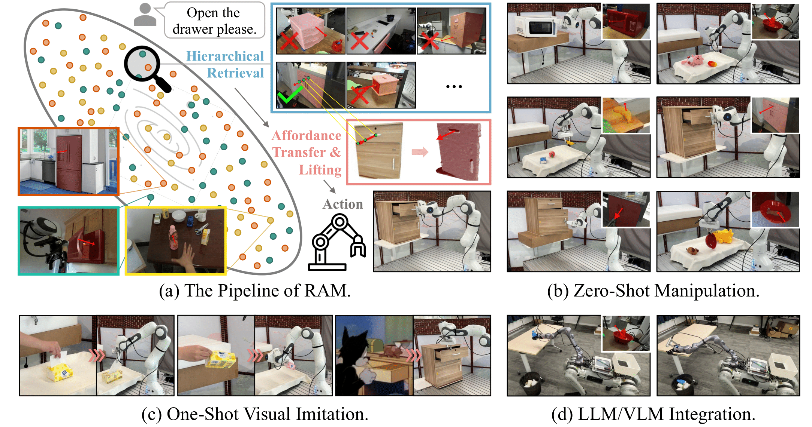
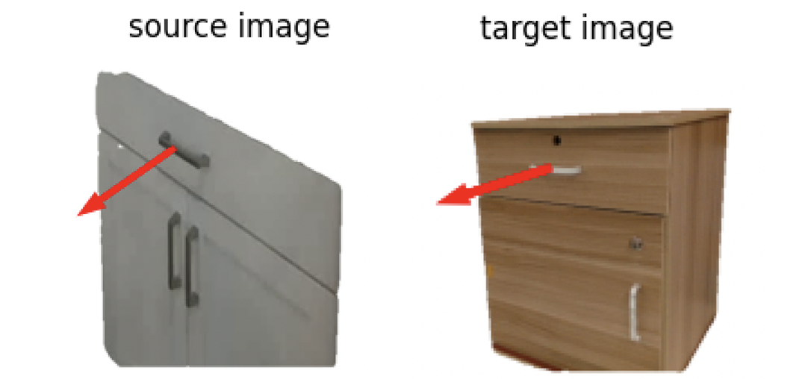
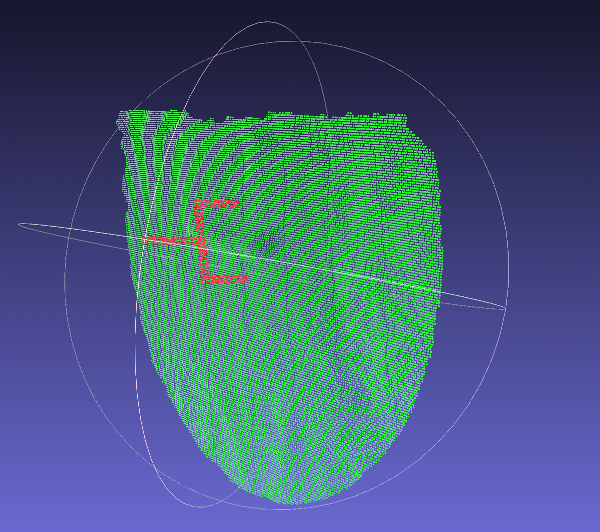
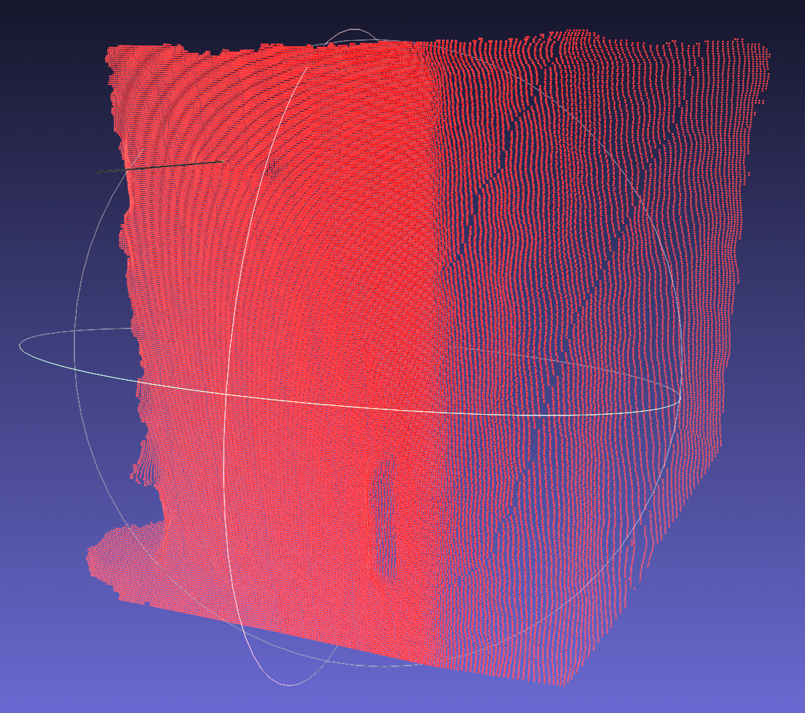

<h1 align="center">
  <b>RAM: Retrieval-Based Affordance Transfer for Generalizable Zero-Shot Robotic Manipulation</b>
</h1>

This is the official code release of [RAM: Retrieval-Based Affordance Transfer for Generalizable Zero-Shot Robotic Manipulation](https://arxiv.org/abs/2407.04689).

**[[paper]](https://arxiv.org/abs/2407.04689) [[project]](https://yxkryptonite.github.io/RAM/) [[code]](https://github.com/yxKryptonite/RAM_code)**

<div align=center>
    
</div>

## NEWS

- [07/07/2024] We released the paper, project page, and code of RAM.

## Installation

1. Create conda environment and install pytorch

    This code is tested on Python 3.8.19 on Ubuntu 20.04, with PyTorch 2.0.1+cu118:

    ```
    conda create -n ram python=3.8
    conda activate ram
    # pytorch 2.0.1 with cuda 11.8
    pip install torch==2.0.1 torchvision==0.15.2 torchaudio==2.0.2 --index-url https://download.pytorch.org/whl/cu118
    ```

2. Grounded-SAM

    Install dependencies and download the checkpoints:

    ```
    pip install -e vision/GroundedSAM/GroundingDINO
    pip install -e vision/GroundedSAM/segment_anything
    wget https://dl.fbaipublicfiles.com/segment_anything/sam_vit_h_4b8939.pth -P assets/ckpts/
    wget https://github.com/IDEA-Research/GroundingDINO/releases/download/v0.1.0-alpha/groundingdino_swint_ogc.pth -P assets/ckpts/
    ```

3. GSNet

    ```
    # MinkowskiEngine, this may take a while
    git clone git@github.com:NVIDIA/MinkowskiEngine.git
    cd MinkowskiEngine
    conda install openblas-devel -c anaconda
    python setup.py install --blas_include_dirs=${CONDA_PREFIX}/include --blas=openblas

    ## pointnet2 & graspnetAPI
    cd graspness_implementation
    pip install -r requirements.txt
    cd pointnet2
    python setup.py install
    cd ..
    cd graspnetAPI
    pip install .
    pip install "numpy<1.24"
    pip install pytorch-utils
    ```

    If you want to use close-sourced [AnyGrasp](https://github.com/graspnet/anygrasp_sdk) as an alternative, please follow [anygrasp_sdk](https://github.com/graspnet/anygrasp_sdk) to setup the SDK and put the `checkpoint_detection.tar` checkpoint to `assets/ckpts/`. And `gsnet.so`, `lib_cxx.so`, and `license/` should be in the project root directory.

4. pointnet2_ops

    ```
    # this may take a while
    git clone git@github.com:erikwijmans/Pointnet2_PyTorch.git
    cd Pointnet2_PyTorch/pointnet2_ops_lib
    pip install -e .
    ```

5. Other requirements

    ```
    pip install -r requirements.txt
    ```

## Inference and Visualization

Run commands below to run the demo:

```
export PYTHONPATH=$PWD
python run_realworld/run.py --config configs/drawer_open.yaml
```

After finished, you shall see printed 3D affordance results w/ grasp and visualization at `run_realworld/gym_outputs/drawer_open/` like below:

<div align=center>
    
</div>
<div align=center>
    
    
</div>

## TODO

- [x] Release the method code and demo.
- [ ] Release the retrieval pipeline and data.
- [ ] More to come...

**Please stay tuned for any updates of the dataset and code!**

## Acknowledgments

We thank authors of [dift](https://github.com/Tsingularity/dift), [GeoAware-SC](https://github.com/Junyi42/geoaware-sc), [graspness_implementation](https://github.com/rhett-chen/graspness_implementation) and [Grounded-Segment-Anything](https://github.com/IDEA-Research/Grounded-Segment-Anything) for their great work and open-source spirit!

## Citation

If you find this work helpful, please consider citing:

```
@article{kuang2024ram,
  title={RAM: Retrieval-Based Affordance Transfer for Generalizable Zero-Shot Robotic Manipulation},
  author={Kuang, Yuxuan and Ye, Junjie and Geng, Haoran and Mao, Jiageng and Deng, Congyue and Guibas, Leonidas and Wang, He and Wang, Yue},
  journal={arXiv preprint arXiv:2407.04689},
  year={2024}
}
```

